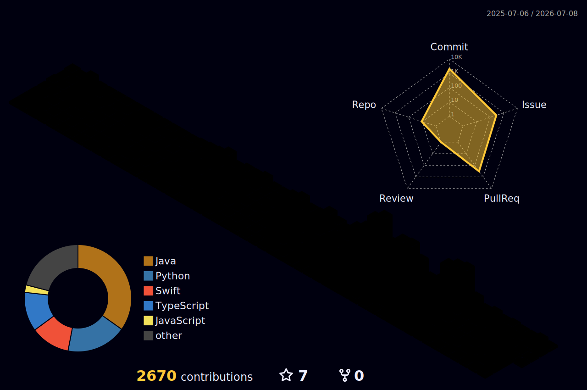

  

 

<h3 align="center">⚡ Tech Stack</h3>

**`Backend`**

**`VoIP`**

**`Frontend`**

**`Database`**

**`Infrastructure`**

 

<h3 align="center">📊 GitHub Stats</h3>

  
  

  

 

  

 

<picture>
  <source media="(prefers-color-scheme: dark)" srcset="https://raw.githubusercontent.com/kanguk01/kanguk01/output/github-snake-dark.svg">
  <source media="(prefers-color-scheme: light)" srcset="https://raw.githubusercontent.com/kanguk01/kanguk01/output/github-snake.svg">
  
</picture>

 

 

